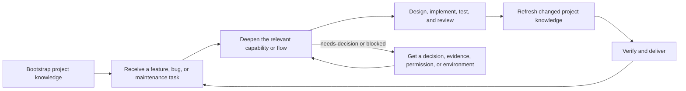

# Maintaining Codebase Knowledge

[中文](README_zh.md)

This skill helps a coding agent understand an existing repository and keep that understanding current as the code changes. It turns facts scattered across code, tests, configuration, documentation, and command output into a small set of project notes to read before development starts.

The first scan does not try to document the whole repository. Bootstrap makes the repository navigable; a concrete feature or bug then triggers Deepen for the relevant area. The skill maintains context. It does not design the change, edit production code, approve decisions, or replace testing and review.

## Modes

| Mode | Use it when | What it does |
|---|---|---|
| `Bootstrap` | The repository is unfamiliar or has no dependable knowledge index. | Records project rules, architecture, commands, one to five capabilities worth understanding first, and any flow that genuinely crosses several capabilities. Other areas remain available for later Deepen work. |
| `Deepen` | You have a specific feature, bug, or maintenance task. | Investigates the relevant capability or flow and fills in the acceptance conditions, code paths, actual behavior, risks, tests, and delivery rules needed for the task. |
| `Refresh` | An implementation has stabilized. | Reads the change and its verification evidence, then updates only the facts that changed. It is not a substitute for a fresh test run. |

## Quick start

### 1. Install one language version

List the skills in this repository:

```shell
npx skills add sparkg/maintaining-codebase-knowledge-skill --list
```

Install either the English or Chinese version in the current project:

```shell
# English
npx skills add sparkg/maintaining-codebase-knowledge-skill --skill maintaining-codebase-knowledge

# Chinese
npx skills add sparkg/maintaining-codebase-knowledge-skill --skill maintaining-codebase-knowledge-zh
```

Add `--agent codex` to target Codex explicitly, `--global` for a user-level installation, or `-y` to skip confirmation. A target repository needs only one language version.

For a manual installation, clone or download this repository and copy one of these directories into the target repository's `.agents/skills/` directory:

- `.agents/skills/maintaining-codebase-knowledge/`
- `.agents/skills/maintaining-codebase-knowledge-zh/`

Do not run both versions against the same target at the same time.

### 2. Map the repository

Replace `path/to/repository` in this prompt:

```text
Use $maintaining-codebase-knowledge in Bootstrap mode on path/to/repository. Build a project-knowledge baseline from repository evidence without modifying production code.
```

Bootstrap uses an existing `AGENTS.md` or `CLAUDE.md` as the project's starting instruction file. If neither exists, it creates `AGENTS.md`. Future development work reads that file first and follows its pointer to `docs/project-knowledge/index.md`.

### 3. Prepare for a feature or bug

```text
Use $maintaining-codebase-knowledge in Deepen mode for this task in path/to/repository: <feature or bug>. Update only the task-relevant intent, capability, flow, and evidence.
```

Deepen starts with the existing index. If the index does not yet point to the documents needed for the task, or those documents are too shallow, it adds only the missing knowledge instead of scanning the repository again.

### 4. Update the notes after implementation

```text
Use $maintaining-codebase-knowledge in Refresh mode on path/to/repository after the implementation has stabilized. Inspect the diff and verification evidence, then update only affected project knowledge.
```

Run tests and other pre-delivery checks after Refresh. Updated documentation does not prove that the code works.

## What Bootstrap creates

A typical Bootstrap creates or reuses this structure in the target repository:

```text
AGENTS.md or an existing CLAUDE.md
docs/project-knowledge/
├── index.md
├── architecture.md
├── onboarding.md
├── intent-ledger.md
├── risks.md
├── capabilities/
└── flows/
```

| Document | Question it answers |
|---|---|
| `AGENTS.md` or `CLAUDE.md` | Where should an agent start, and which working rules must it follow? |
| `index.md` | Which document should I read for this task? |
| `architecture.md` | What are the main parts of the system, how do they depend on each other, and which code implements each capability? |
| `onboarding.md` | How do I set up, run, and test the project? What delivery work is required for this type of change? |
| `intent-ledger.md` | Which requirements, bugs, and backlog items are active? Which capability or flow documents apply to each one? What still needs a decision? |
| `risks.md` | Which risks affect several features, and how could they affect reliability, security, compatibility, or operations? |
| `capabilities/` | How does a business capability behave, where is its code, and how is it verified? |
| `flows/` | When an operation passes through several capabilities, what is the order? How do they hand work off, and how do failures and side effects propagate? |

The skill creates `external-systems.md` only when an outside source affects development. It creates an ADR only for an accepted or explicitly proposed decision that has supporting evidence. An undocumented area is not automatically a Bootstrap failure; Deepen can map it when a task needs it.

## How it fits into development



A development workflow starts at the project instruction file, opens the index, and finds the documents for its task. The readiness result tells it whether to continue:

- `ready-for-design`: the known facts are enough to make local design choices.
- `ready-for-implementation`: the task contract, relevant mechanics, verification, and delivery conditions are clear enough to code.
- `needs-deepen`, `needs-decision`, or `blocked`: the result names the missing knowledge or action.

The skill provides this handoff without depending on a particular development workflow or taking over design and implementation.

## How the notes stay trustworthy

Different claims need different evidence: code for current mechanics, tests and recent command output for verified behavior, configuration and schemas for external contracts, and authorized requirement sources for intended behavior.

Each durable fact is explained fully in one document and linked from the others. Capabilities, cross-capability flows, and code modules stay separate because they answer different questions.

If a task changes a public interface or another integration boundary, Deepen checks the applicable runtime behavior, types, schemas, examples, documentation, and tests. It also separates requested behavior from extra hardening suggested by code or test evidence.

Whether or not the repository uses version control, and whether or not its working tree is clean, the skill records a revision or content hash to identify the code behind each evidence snapshot. It preserves user-written text and rewrites only its own managed files or marked blocks. It does not store secrets, invent historical rationale, modify production code, or claim that a Refresh proves correctness.

## Enterprise systems and conversation context

The skill can use a PRD, ticket, CI result, incident, conversation detail, or document snapshot when the user provides it or authorizes access. It records only the stable facts needed for development, together with enough source information to find the original record. The enterprise system remains the source of truth.

Reading authorized context does not authorize writing back to that system. Workflow transitions, comments, CI actions, and other external changes still need explicit permission. Credentials, customer data, private discussion, restricted source text, and anything forbidden by repository policy are not written into project knowledge. Volatile status stays in the source system or the current task context.

## Repository layout

- `.agents/skills/maintaining-codebase-knowledge/` contains the English skill.
- `.agents/skills/maintaining-codebase-knowledge-zh/` contains the equivalent Chinese skill.
- `SKILL.md` defines the modes, boundaries, intake, and result contract.
- `references/` holds the knowledge model and integration rules.
- `assets/templates/` contains the managed-document templates.
- `agents/openai.yaml` provides agent-facing metadata.

## Validation

Static checks cover package format, UTF-8, bilingual structure, managed markers, and independence from a particular development framework. Those checks catch packaging mistakes, not weak project knowledge.

For behavioral validation, a fresh development agent works on a repeatable repository task using the generated notes. The result is checked with focused tests of the requested behavior, the full regression suite, an exploration log, and code review, then compared with a no-document baseline. A documentation change is accepted only when development quality holds steady or improves.

## Contributing

Keep both language versions behaviorally equivalent. English may be used as the structural editing source, but the Chinese version should read naturally rather than mirror English word for word. Preserve the same rules, states, fields, and stop conditions in both versions.

Before submitting a change, run both official validators, the bilingual structure checks, and the independent downstream scenarios affected by the change. Keep each fact with one owner, avoid repeated instructions, and do not add knowledge from a specific target repository to the reusable skill.

## License

Released under the [MIT License](LICENSE).
