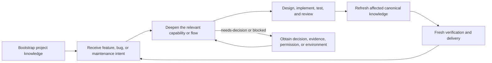

# Maintaining Codebase Knowledge

[中文](README_zh.md)

Build and continuously maintain evidence-backed project knowledge so coding agents can take over existing repositories without repeatedly rediscovering the architecture, business capabilities, runtime flows, and development constraints.

- Discover repository structure and behavior from implementation evidence such as code, tests, configuration, schemas, and reproducible checks.
- Bootstrap a selective baseline around instructions, architecture, commands, and one to five high-value capabilities.
- Deepen only the capability or flow required for a feature, bug, or maintenance task.
- Refresh only canonical knowledge affected by stable implementation changes.
- Supply project knowledge to any development workflow that follows the documented consumption contract.
- Provide behaviorally equivalent English and Chinese project-local skills.
- Preserve user-authored documentation while managing only marked documents and instruction blocks.

## Why This Project

Existing repositories rarely lack information; they lack a small, current, evidence-backed route from a development request to the architecture, behavior, invariants, tests, and constraints that matter. Coding agents otherwise spend each task rediscovering the same codebase, or rely on broad summaries that become stale and blur intent with implementation.

Maintaining Codebase Knowledge creates a navigable baseline, deepens it on demand, and refreshes it after implementation. It supplies reliable context without taking ownership of design, implementation, workflow state, human decisions, runtime verification, permissions, or external systems.

## How It Works

| Mode | When and what it maps |
|---|---|
| `Bootstrap` | For an unfamiliar repository or one without a reliable knowledge index. Maps project instructions, architecture, commands, one to five high-value capabilities, and only material cross-capability flows. |
| `Deepen` | Starts from a requested feature, bug, maintenance intent, or routed ledger entry. Extracts task-critical symbols, state or algorithm behavior, invariants, tests, evidence, and placement signals without re-running Bootstrap. |
| `Refresh` | Starts after implementation stabilizes. Inspects the change and updates only affected canonical knowledge before fresh completion verification. |

## Quick Start

### 1. Choose a language variant

Download or clone this repository, then copy one project-local skill directory into the target repository's `.agents/skills/` directory:

- English: `.agents/skills/maintaining-codebase-knowledge/`
- Chinese: `.agents/skills/maintaining-codebase-knowledge-zh/`

The variants are behaviorally equivalent; do not run both against the same target at the same time.

### 2. Bootstrap an existing repository

Replace `path/to/repository` only when running the prompt:

```text
Use $maintaining-codebase-knowledge in Bootstrap mode on path/to/repository. Build an evidence-backed project-knowledge baseline without modifying production code.
```

Bootstrap selects the target repository's project instruction bridge—an existing `AGENTS.md`, an existing `CLAUDE.md`, or a newly created `AGENTS.md`—and routes subsequent development through `docs/project-knowledge/index.md`.

### 3. Deepen for a feature or bug

```text
Use $maintaining-codebase-knowledge in Deepen mode for this task in path/to/repository: <feature or bug>. Update only the task-relevant intent, capability, flow, and evidence.
```

Development begins at the selected project instruction bridge and `docs/project-knowledge/index.md`. If the task route is absent or too shallow, Deepen updates the smallest task-relevant knowledge set instead of re-Bootstrapping the repository.

### 4. Refresh after implementation

```text
Use $maintaining-codebase-knowledge in Refresh mode on path/to/repository after the implementation has stabilized. Inspect the diff and verification evidence, then update only affected canonical knowledge.
```

Refresh updates current-state documentation; the independent development workflow still performs fresh completion verification.

## Generated Project Knowledge

A typical selective Bootstrap produces this structure at the resolved target repository root:

```text
AGENTS.md or an existing CLAUDE.md
docs/project-knowledge/
├── index.md
├── architecture.md
├── onboarding.md
├── intent-ledger.md
├── risks.md
├── capabilities/
└── flows/
```

- The selected project instruction bridge gives development workflows a stable pointer to the knowledge index and critical working agreements.
- `index.md` is the small canonical entrypoint and navigation map for concrete project-knowledge routes.
- `architecture.md` owns the system-wide structure, dependency direction, capability-to-implementation-unit mapping, boundary evidence, and default cross-cutting mechanisms.
- `onboarding.md` owns stable prerequisites, commands, and reproducible project baselines.
- `intent-ledger.md` routes requirements, backlog items, issues, and other intents to a capability or flow, with planning readiness and the next required action.
- `risks.md` owns cross-capability reliability, security, compatibility, and operational risks.
- `capabilities/` describes each selected business or domain ability, including current behavior, contracts, invariants, implementation evidence, and tests.
- `flows/` owns reusable ordering and handoff contracts that cross two or more capability owners; local sequences remain in their capability document.

`external-systems.md` is created only when external sources materially affect development. ADRs under `adr/` are created only when repository evidence and an accepted or explicitly proposed decision justify them. Other areas remain valid on-demand Deepen work rather than Bootstrap omissions that require a full rescan.

## Development Loop

This project supplies evidence-backed context. It does not own design, implementation, testing, review, delivery, or their workflow state.



Any development workflow can consume the knowledge by following the selected instruction bridge to the index, then reading the routed intent, capability, and flow. A `needs-decision` or `blocked` result names the decision, evidence, permission, or environment change required before coding continues.

## Evidence and Safety Principles

- Prefer code, tests, configuration, schemas, CI, deployment definitions, and fresh command output for the claim types they can support.
- Keep intent, implementation support, confidence, planning readiness, persistence, and documentation depth separate.
- Give every durable fact one canonical document owner and link to it elsewhere.
- Treat business capabilities, cross-capability flows, and implementation modules as different concepts, then map their relationships with evidence.
- Support clean VCS, dirty VCS, and no-VCS repositories with scoped revision or content-hash evidence snapshots.
- Preserve user-authored content and structurally rewrite only documents or blocks carrying managed markers.
- Do not expose secrets, modify production code, invent historical rationale, or treat documentation Refresh as proof that code works.

## Enterprise and Conversation Context

Explicitly provided or authorized PRDs, tickets, CI runs, incidents, conversation details, and document snapshots may be distilled into repository knowledge when they are stable, relevant, permitted, and sufficiently sourced. Enterprise systems remain canonical for the records they own. External writes, workflow transitions, CI actions, and other mutations require separate authorization from the owning workflow.

Credentials, customer data, private discussion, restricted source text, and content forbidden by repository policy are not persisted. Volatile workflow or operational state remains external, task-scoped, or session-only.

## Repository Layout

- `.agents/skills/maintaining-codebase-knowledge/` contains the English skill.
- `.agents/skills/maintaining-codebase-knowledge-zh/` contains the behaviorally equivalent Chinese skill.
- Each `SKILL.md` defines the operating modes, boundaries, intake, and result contract.
- Each `references/` directory contains the knowledge model, external-context rules, and development-workflow consumption contract.
- Each `assets/templates/` directory provides deterministic managed-document templates.
- Each `agents/openai.yaml` supplies agent-facing skill metadata.

## Validation

The release checks establish that:

- Both skill directories pass the official `quick_validate.py` validator.
- The English and Chinese variants have matching package structure, operating modes, result contracts, references, and template roles.
- The public skill packages do not depend on or integrate with a named development framework.

## Contributing

Keep English and Chinese behavior synchronized. Before submitting a change, run both official skill validators and regression checks for target-root resolution, project instruction bridge selection, managed markers, UTF-8, Bootstrap, Deepen, and Refresh. Preserve canonical ownership, avoid duplicated claims, and keep project-specific knowledge out of the reusable skills.

## License

This project is released under the [MIT License](LICENSE).
