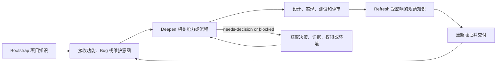

# 维护代码库知识

[English](README.md)

构建并持续维护有证据支撑的项目知识，使编码智能体能够接手现有仓库，而不必反复重新发现架构、业务能力、运行时流程和开发约束。

- 从代码、测试、配置、schema 和可复现检查等实现证据中发现仓库结构与行为。
- 围绕指令、架构、命令和一到五个高价值能力，Bootstrap 一个有选择性的基线。
- 只 Deepen 功能、Bug 或维护任务所需的能力或流程。
- 只 Refresh 受稳定实现变更影响的规范知识。
- 按照文档化的消费契约，为任何开发工作流提供项目知识。
- 提供行为等价的英文和中文项目本地 Skill。
- 保留用户撰写的文档，只管理带标记的文档和指令块。

## 为什么需要这个项目

现有仓库往往并不缺少信息；它们缺少的是一条精简、最新且有证据支撑的路径，能够从开发请求通往相关的架构、行为、不变量、测试和约束。否则，编码智能体会在每个任务中重复发现同一代码库，或依赖宽泛且容易过时、混淆意图与实现的摘要。

维护代码库知识会创建可导航的基线，按需深化，并在实现后刷新。它提供可靠的上下文，但不负责设计、实现、工作流状态、人类决策、运行时验证、权限或外部系统。

## 工作方式

| 模式 | 使用时机及映射内容 |
|---|---|
| `Bootstrap` | 用于不熟悉的仓库或缺少可靠知识索引的仓库。映射项目指令、架构、命令、一到五个高价值能力，以及仅具实质意义的跨能力流程。 |
| `Deepen` | 从请求的功能、Bug、维护意图或已路由的台账条目开始。提取任务关键符号、状态或算法行为、不变量、测试、证据和放置线索，而不重新运行 Bootstrap。 |
| `Refresh` | 在实现稳定后开始。检查变更，并在重新执行完成验证前只更新受影响的规范知识。 |

## 快速开始

### 1. 选择语言版本

下载或克隆本仓库，然后将一个项目本地 Skill 目录复制到目标仓库的 `.agents/skills/` 目录：

- 英文：`.agents/skills/maintaining-codebase-knowledge/`
- 中文：`.agents/skills/maintaining-codebase-knowledge-zh/`

两个版本行为等价；不要同时在同一目标上运行二者。

### 2. Bootstrap 现有仓库

仅在运行提示词时替换 `path/to/repository`：

```text
在 path/to/repository 上以 Bootstrap 模式使用 $maintaining-codebase-knowledge-zh。构建有证据支撑的项目知识基线，不要修改生产代码。
```

Bootstrap 会选择目标仓库的项目指令桥接文件——现有的 `AGENTS.md`、现有的 `CLAUDE.md` 或新创建的 `AGENTS.md`——并通过 `docs/project-knowledge/index.md` 为后续开发提供路由。

### 3. 为功能或 Bug 执行 Deepen

```text
针对 path/to/repository 中的此任务，以 Deepen 模式使用 $maintaining-codebase-knowledge-zh：<功能或 Bug>。只更新与任务相关的意图、能力、流程和证据。
```

开发从选定的项目指令桥接文件和 `docs/project-knowledge/index.md` 开始。如果任务路由缺失或过浅，Deepen 会更新与任务相关的最小知识集，而不是对仓库重新执行 Bootstrap。

### 4. 实现后执行 Refresh

```text
在 path/to/repository 的实现稳定后，以 Refresh 模式使用 $maintaining-codebase-knowledge-zh。检查 diff 和验证证据，然后只更新受影响的规范知识。
```

Refresh 更新当前状态文档；独立的开发工作流仍会重新执行完成验证。

## 生成的项目知识

典型的选择性 Bootstrap 会在解析出的目标仓库根目录生成以下结构：

```text
AGENTS.md or an existing CLAUDE.md
docs/project-knowledge/
├── index.md
├── architecture.md
├── onboarding.md
├── intent-ledger.md
├── risks.md
├── capabilities/
└── flows/
```

- 选定的项目指令桥接文件为开发工作流提供指向知识索引和关键工作约定的稳定指针。
- `index.md` 是精简的规范入口，也是具体项目知识路由的导航图。
- `architecture.md` 负责全系统结构、依赖方向、能力到实现单元的映射、边界证据和默认的横切机制。
- `onboarding.md` 负责稳定的先决条件、命令和可复现的项目基线。
- `intent-ledger.md` 将需求、待办项、issue 和其他意图路由到能力或流程，并记录规划就绪度和下一项必要行动。
- `risks.md` 负责跨能力的可靠性、安全性、兼容性和运维风险。
- `capabilities/` 描述每个选定的业务或领域能力，包括当前行为、契约、不变量、实现证据和测试。
- `flows/` 负责跨越两个或更多能力所有者的可复用时序与交接契约；局部序列仍保留在其能力文档中。

只有当外部来源对开发有实质影响时，才创建 `external-systems.md`。只有当仓库证据以及已接受或明确提议的决策能够证明其合理性时，才在 `adr/` 下创建 ADR。其他领域仍是有效的按需 Deepen 工作，而不是需要完整重新扫描的 Bootstrap 遗漏。

## 开发循环

本项目提供有证据支撑的上下文。它不负责设计、实现、测试、评审、交付或这些活动的工作流状态。



任何开发工作流都可以消费这些知识：沿选定的指令桥接文件进入索引，然后读取已路由的意图、能力和流程。`needs-decision` 或 `blocked` 结果会指出编码继续前所需的决策、证据、权限或环境变更。

## 证据与安全原则

- 对于各类证据所能支持的声明，优先采用代码、测试、配置、schema、CI、部署定义和新的命令输出。
- 将意图、实现支持、置信度、规划就绪度、持久化和文档深度彼此分开。
- 为每个持久事实指定一个规范文档所有者，并在其他位置链接到它。
- 将业务能力、跨能力流程和实现模块视为不同概念，然后用证据映射它们之间的关系。
- 通过限定范围的 revision 或内容哈希证据快照，支持干净 VCS、脏 VCS 和无 VCS 仓库。
- 保留用户撰写的内容，只对带托管标记的文档或区块进行结构化重写。
- 不要暴露 secret、修改生产代码、虚构历史依据，或将文档 Refresh 当作代码可用的证明。

## 企业系统与对话上下文

对于明确提供或授权的 PRD、ticket、CI 运行、事故、对话详情和文档快照，当它们稳定、相关、获准且来源充分时，可以将其提炼为仓库知识。企业系统仍是其所负责记录的规范来源。外部写入、工作流状态转换、CI 操作和其他变更，需要获得所属工作流的另行授权。

不会持久化凭据、客户数据、私密讨论、受限源文本和仓库策略禁止的内容。易变的工作流或运维状态保留在外部、任务范围内或仅当前会话中。

## 仓库结构

- `.agents/skills/maintaining-codebase-knowledge/` 包含英文 Skill。
- `.agents/skills/maintaining-codebase-knowledge-zh/` 包含行为等价的中文 Skill。
- 每个 `SKILL.md` 定义运行模式、边界、接入和结果契约。
- 每个 `references/` 目录包含知识模型、外部上下文规则和开发工作流消费契约。
- 每个 `assets/templates/` 目录提供确定性的托管文档模板。
- 每个 `agents/openai.yaml` 提供面向智能体的 Skill 元数据。

## 验证

发布检查确认：

- 两个 Skill 目录都通过官方 `quick_validate.py` 验证器。
- 英文版和中文版具有一致的包结构、运行模式、结果契约、参考文档和模板职责。
- 公开 Skill 包不依赖或集成任何具名开发框架。

## 参与贡献

保持英文和中文的行为同步。提交变更前，对两个 Skill 运行官方验证器，并运行目标根目录解析、项目指令桥接文件选择、托管标记、UTF-8、Bootstrap、Deepen 和 Refresh 的回归检查。保持规范所有权，避免重复声明，并将项目专属知识排除在可复用 Skill 之外。

## 许可证

本项目基于 [MIT 许可证](LICENSE) 发布。
